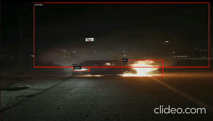

# Fire & Smoke Detection with NVIDIA DeepStream 8

Real-time fire and smoke detection using **YOLOv8**, **NVIDIA DeepStream 8**, and **RTSP** streaming.

The application receives an RTSP video stream, performs GPU-accelerated inference using DeepStream, draws detection bounding boxes, and publishes the processed video as a new RTSP stream.

---

## Features

- 🔥 Fire detection
- 💨 Smoke detection
- 📡 RTSP input
- 📡 RTSP output
- ⚡ GPU-accelerated inference (TensorRT)
- 🎯 YOLOv8 detector
- 🐳 Docker-based environment
- 🧩 Modular project structure

---

## Results

<p align="center">
  
</p>
---

## Technology Stack

- NVIDIA DeepStream 8.0
- TensorRT 10
- CUDA 12.x
- GStreamer
- Python
- YOLOv8
- DeepStream Python Bindings

---

# Environment

The project is designed to run inside the official NVIDIA DeepStream Docker container.

Start the container using:

```bash
docker run --gpus all -it --rm \
    --network=host \
    --privileged \
    nvcr.io/nvidia/deepstream:8.0-gc-triton-devel
```

---

# Project Base

The project is based on the official NVIDIA DeepStream Python Applications repository:

https://github.com/NVIDIA-AI-IOT/deepstream_python_apps/tree/v1.2.2

The original NVIDIA example was refactored into a modular application with separated pipeline, source management, RTSP server, probe logic, configuration, and argument parsing.

---

# YOLO Parser

This project uses the custom parser from:

https://github.com/marcoslucianops/DeepStream-Yolo

Clone the repository:

```bash
git clone https://github.com/marcoslucianops/DeepStream-Yolo.git
```

---

## Why parser modification is required

The original DeepStream-Yolo parser expects the standard YOLO output format.

The model used in this project exports detections in the following layout:

```
output0
shape = [1, 7, 8400]
```

where

```
channel 0 -> center x
channel 1 -> center y
channel 2 -> width
channel 3 -> height
channel 4 -> fire score
channel 5 -> other score
channel 6 -> smoke score
```

Therefore the parser must be modified to correctly decode this tensor.

The parser source is located at:

```
DeepStream-Yolo/
└── nvdsinfer_custom_impl_Yolo/
    └── nvdsparsebbox_Yolo.cpp
```

The decoding function should be updated to interpret the tensor in **channel-first** format.

---

## Building the custom parser

After modifying the parser, build the shared library:

```bash
cd DeepStream-Yolo/nvdsinfer_custom_impl_Yolo

make CUDA_VER=12.8
```

This generates:

```
libnvdsinfer_custom_impl_Yolo.so
```

Copy the library into the project directory (or update the configuration path accordingly).

---

# Project Structure

```
fire_smoke/

├── main.py
├── pipeline.py
├── source.py
├── probe.py
├── rtsp_server.py
├── parser_args.py
├── config.py
├── settings.py
│
├── dstest1_pgie_config.txt
├── labels.txt
│
├── model.onnx
├── model.engine
│
└── libnvdsinfer_custom_impl_Yolo.so
```

---

# Pipeline

```
RTSP Input
      │
      ▼
 uridecodebin
      │
      ▼
 nvstreammux
      │
      ▼
 nvinfer
      │
      ▼
 nvdsosd
      │
      ▼
 Encoder
      │
      ▼
 RTP Payloader
      │
      ▼
 UDP
      │
      ▼
 RTSP Server
      │
      ▼
 RTSP Output
```

---

# Running

Example:

```bash
python3 main.py \
    -i rtsp://127.0.0.1:8554/fire
```

After startup the processed stream becomes available at:

```
rtsp://localhost:8556/ds-test
```

---

# Command Line Arguments

| Argument | Description |
|-----------|-------------|
| `-i` | Input RTSP stream |
| `-g` | Inference backend (`nvinfer` / `nvinferserver`) |
| `-c` | Output codec (`H264` / `H265`) |
| `-b` | Encoder bitrate |
| `--rtsp-ts` | Use RTSP timestamps |

---

# Detection Classes

| ID | Class |
|----|--------|
| 0 | Fire |
| 1 | Other |
| 2 | Smoke |

---

# Project Capabilities

- receives one or more RTSP streams
- performs TensorRT inference on NVIDIA GPU
- detects fire and smoke in real time
- overlays bounding boxes and class labels
- encodes processed video using H.264 or H.265
- publishes processed video via RTSP
- supports DeepStream batch processing
- supports RTSP timestamp synchronization

---

# Notes

The TensorRT engine is generated automatically during the first application launch if no serialized engine is found.

Subsequent launches reuse the generated engine for significantly faster startup.

---

# Acknowledgements

- NVIDIA DeepStream SDK
- NVIDIA DeepStream Python Apps
- DeepStream-Yolo by Marcos Luciano
